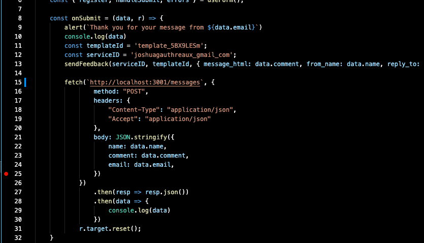

A portfolio created in react to showcase projects and contact me.   
Visit this site live at [joshgotro.com](https://joshgotro.com)

## Installation
Clone repo and navigate into the folder.     
Run `npm install` in the terminal.  

## Overview / Features

The purpose of this portfolio is two-fold, to create a space where people can look at my projects and contact me, and to learn some new techniques and coding skills. 

One area I focused on learning was expanding my knowledge in CSS without using any external libraries. This project makes use of @media queries focused on making the site viewable from desktop, tablet, and mobile. I also learned about gradients, transitions, smooth srolling (an alternative to React Router Dom), and general page layout. 

I also wanted a contact form that would forward messages to my email. For this functionality I am using [Email.js](https://www.emailjs.com/), which allows you to send emails directly from client side. 

In additon, I learned how to use SVG components in order to link my social media accounts. 

Lastly, I wanted to challenge myself to deploy the site so it can be visited live. Please note that the json.package and fetch calls are configured to point to Heroku, where the site is actively deployed. You can visit my site through the heroku domain, or from my personal domain where I have it forwarded.
https://gotro-portfolio-frontend.herokuapp.com/
https://joshgotro.com

### Optional Rails --API
This project is written to work with a Rails 6 backend in order to persist messages from the Contact Form.   
Repo can be found at https://github.com/Josh-Gotro/gotro-api

The contact form will still work without the Rails backend. This portfolio

gotro-client > src > SayHi.js  
lines 15 - 31   

  
    
      

  
    
      
## Thank you for visiting.   
For questions, comments, or concerns, please reach me through any of the following:  
joshuagauthreaux@gmail.com    
[LinkedIn](https://www.linkedin.com/in/josh-gauthreaux/)  
[joshgotro.com](https://joshgotro.com)  
   